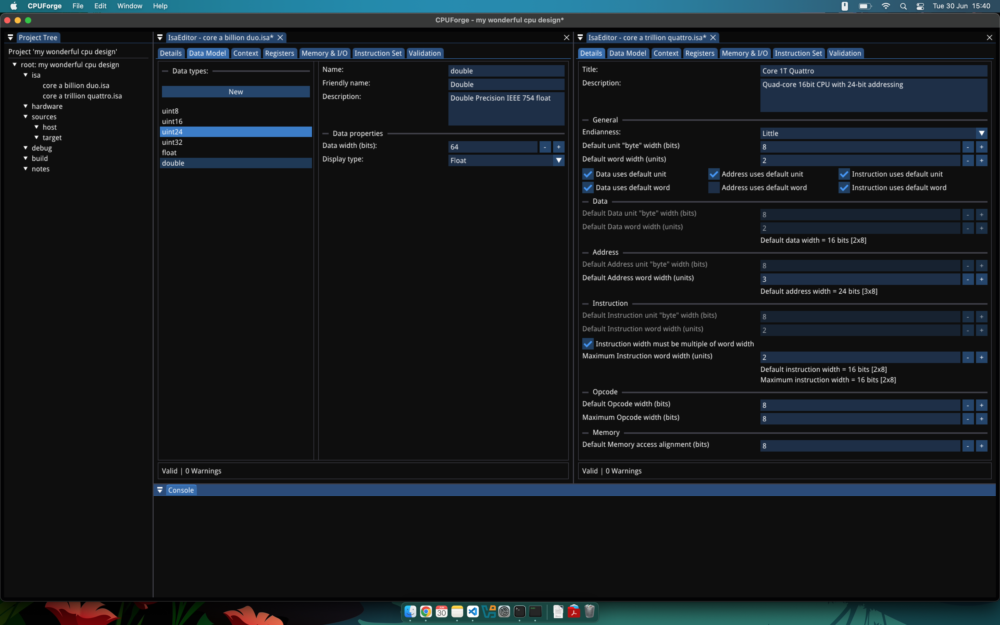

# CPUForge

**CPUForge** is a custom computer architecture laboratory, software IDE, and simulator package written in C++.

The goal of CPUForge is to provide an interactive environment for designing, editing, and simulating custom computer architectures. It is intended as both a learning tool and an experimental workspace for exploring instruction set architecture design, hardware modelling, software and toolchain development, and low-level systems concepts. Everyone else seems to be designing their own CPUs these days, this is my take on the trend ;)

Despite the name, CPUForge is intended to provide an abstract, intent-agnostic environment for experimenting with computer systems architecture and processor design: from simple education CPUs, single or multi-core CPUs, GPUs, embedded processors, and DSP, to novel, experimental, and avant-garde computational machines. 

> CPUForge is currently in early development. The core application framework, project system, command dispatch layer, UI shell, and initial ISA modelling groundwork are being built before the simulator itself is fully implemented.




## Project goals

CPUForge aims to become a desktop application where users can experiment with CPU and systems design ideas in a visual IDE-style environment:

- Define custom instruction set architectures
    - Describe context-dependent processor behaviour such as privilege modes, memory spaces, faults, and execution states
    - Model registers, memory behaviour, addressing rules, faults, and port I/O
- Design hardware implementations for custom architectures
    - Develop reusable hardware components at register-transfer level using logic diagram editor
    - Define hardware implementations as hierarchical 
- Write or import source/binary files for simulated machines
    - Develop custom build toolchains for target architectures
    - Develop custom debugging tools for target architectures
- Run architecture-aware simulations
    - Inspect and debug simulated CPU, memory, hardware, and execution state with rich contextual metadata
    - Replay, rewind, step, and timeline-scrub through execution to explore behaviour
  
The long-term goal is to provide a comprehensive and flexible framework for designing, implementing, and testing custom computer architectures.

## Design vision

A usable architecture design environment needs several layers to fit together:

```text
ISA definition
    ↓
Hardware design
    ↓
Software / binary inputs
    ↓
Simulation
    ↓
Debugging and inspection
```

### ISA Design

The ISA Design module is where the architectural contract of a CPUForge project is created. It defines the machine that software sees: registers, register files, instruction formats, opcodes, data widths, addressing assumptions, execution contexts, faults, and instruction behaviour.

The Profile tab captures the broad details of the ISA, including its name, description, version, endianness, default data/address/instruction/opcode widths, and other baseline properties. These settings provide a common foundation for the rest of the design while still allowing specific parts of the ISA to override or extend them where appropriate.

Registers and register files are created through a visual editor, making it easier to model architectural state in a structured way. Users can define individual registers, grouped register files, aliases, special-purpose registers, status fields, and context-linked state without having to manually wire everything together in code or raw data files.

Instructions are edited through both a list view and an opcode table view. The list view focuses on individual instruction definitions: operands, formats, logic, effects, faults, context restrictions, and documentation. The opcode table focuses on the shape of the instruction set as a whole, showing how instructions occupy the available encoding space. Instructions can be rearranged visually where the encoding rules allow it, with validation ensuring that opcode conflicts, reserved ranges, and expansion rules are respected.

When the ISA is ready, CPUForge can validate and compile it for use elsewhere in the project. Validation checks the editable definition for consistency, while compilation produces a stable artefact that other modules can depend on. This compiled ISA can then be used by simulators, assemblers, hardware designs, tests, and debugging tools.

ISA definitions are intended to evolve over time without breaking the rest of the project. CPUForge therefore treats compiled ISAs as versioned artefacts that can be locked in for a particular stage of development. A hardware design or software test suite can target a known ISA version while the user continues experimenting with future revisions. Over time, this also opens the door to ISA extensions and optional feature sets, allowing projects to grow from a small base architecture into richer variants without losing track of compatibility.

#### Execution Contexts

One of CPUForge's fundamental design ideas is the use of abtract **Execution Contexts** to represent all manner of architectural state such as:
- Privilege levels
- Execution modes
- Memory address spaces
- Interrupt states
- Register-bank selection
- Active process or task state
- Hardware-defined control flags
- User-defined architecture modes

An instruction context is a way of describing the conditions under which a particular instruction, register, memory rule, fault, or behaviour is valid. For example, an architecture might define different behaviours for user mode and kernel mode, or allow an instruction only when a certain feature flag or execution state is active.

This abstraction is intended to make CPUForge useful for both conventional CPU designs and more experimental architectures. A simple simulated CPU might only use one default context. A more advanced design might use contexts to describe privilege rings, virtual memory spaces, interrupt modes, banked registers, capability states, or custom execution environments.

The goal is to provide enough structure that context-dependent behaviour can be described, validated, simulated, and debugged consistently, without tying the user to any specific functionality or design paradigms.

### Hardware Design

The Hardware Design module is where an ISA gets implemented into a hardware definition. CPUForge uses register-transfer level design, meaning the hardware is defined purely by combinatorial logic and synchronous (clocked) registers. This will limit the appeal of the hardware editor as a general-purpose logic design tool, but *should* provide the basis for performant simulation of large and complex designs.

Hardware is designed visually through a logic diagram editor. Users can place components, connect signals, define registers, build logic, and organise control paths without having to immediately drop into HDL or simulator-specific code. The intent is to make the structure of the machine visible and inspectable, while still being precise enough to drive simulation and debugging.

Hardware implementations are built from sheets. A top-level sheet represents the main hardware design, while other sheets can be included as reusable subcomponents. This allows designs to be organised hierarchically: a processor might contain an ALU sheet, a decoder sheet, a register file sheet, a memory controller sheet, and other custom components. Larger designs can therefore grow naturally without forcing every signal and gate into a single flat diagram.

CPUForge aims to provide a library of built-in components for common hardware needs, including logic gates, multiplexers, decoders, counters, clocks, memory blocks, and other basic digital building blocks. Larger memory areas will be supported as first-class components, with built-in text/hex editor views and support for loading from/saving to various file types on the host system. Over time, this may also extend to filesystem mirroring, memory-mapped devices, and other external interfaces useful for more complete simulated systems.

The hardware designer is also intended to support output and inspection devices. Simple designs may only need LEDs, numeric readouts, or console output. More advanced projects may want text-mode displays, framebuffer-style video output, vector displays, or custom visual devices. Rather than treating these as hard-coded special cases, CPUForge should eventually provide an interface for external or user-defined components, allowing projects to add their own display types, devices, or host-side integrations.

Users are encouraged to build their own components and reuse them across a project. CPUForge will support this through a component interface designer, allowing users to define the pins, ports, labels, indicators, and value readouts that appear when a component is used inside a parent sheet.
This means a complex component can expose the information that matters without revealing every internal detail. For example, a register file component might show selected register values, write-enable state, or active read ports directly on its parent-sheet symbol. A display controller might expose status flags or current mode. A CPU core might show clock state, program counter, current instruction, or fault state. The goal is to provide important state at the higher levels of a design, while preserving the ability to inspect deeper layers when needed.

The long-term intent is for hardware designs to act as reusable, inspectable implementations of an ISA. A project might contain several hardware implementations of the same architecture, ranging from a simple educational single-cycle design to a more detailed multi-stage or microcoded version. By keeping the ISA contract separate from the hardware implementation, CPUForge allows users to experiment with different designs while still validating them against the same architectural expectations. This will also allow like-for-like comparisons of different hardware implementations using a common ISA. 

### todo sw, sim, debug sections

## Current status

The project is currently focused on the application foundation:

- ~~SDL/OpenGL/Dear ImGui application shell~~
- ~~Native-style desktop UI workflow~~
- ~~Project creation, opening, saving, and file-tree management~~
- ~~Command queue and dispatcher system~~
- Window and modal management
- Component registry groundwork
- ISA definition data structures
- Initial ISA editor/component scaffolding

The simulator, hardware editor, assembler tooling, and full ISA editing workflow are still under active design and development.

## Tech stack

CPUForge is primarily written in C++20
Current dependencies and tooling include:

- CMake
- vcpkg
- SDL
- OpenGL
- Dear ImGui
- nlohmann/json
- fmt

Some platform-specific code is provided for native top bar integration on macOS.
Note: I can only test on a 2015 Intel MBP with macOS 12 so anyone on later models, especially apple sillicon, please advise of any platform specific issues.

## Repository layout

```text
CPUForge/
├── external/              # External dependencies
├── src/                   # Main application source
│   ├── components/        # App components and feature-specific editor state
│   ├── core/              # Core application and domain models
│   │   └── isa/           # ISA definition structures
│   ├── project/           # Project data, project files, persistence, workspace state
│   ├── queue/             # App command queue and command dispatcher
│   ├── ux/                # UI shell, windows, menu bar, modals, and UI modules
│   ├── AppContext.h       # Shared application state
│   └── CPUForge.cpp       # Main application entry point
├── CMakeLists.txt
├── CMakePresets.json
├── vcpkg.json
└── README.md
```

## Architecture overview

CPUForge is organised around a command-driven application model.

At a high level:

```text
User interaction
    ↓
Dear ImGui UI
    ↓
AppCommandRequest
    ↓
AppCommandQueue
    ↓
AppCommandDispatcher
    ↓
ProjectManager / WorkspaceManager / WindowManager / ComponentRegistry
    ↓
Updated application state
```

This keeps UI code mostly focused on presentation and user intent, while application state changes are routed through a central dispatcher.

### Main layers

#### App shell

The app shell owns the main loop, render cycle, shared application context, and command processing.

#### Project layer

The project layer manages saved project data, project files, folders, file types, JSON persistence, UUID assignment, and dirty-state tracking.

#### Workspace layer

The workspace layer tracks transient editor state such as selected files, selected folders, recent actions, and future open-document state.

#### UX layer

The UX layer contains the Dear ImGui interface, including windows, modals, menus, project tree views, and editor panels.

#### Component layer

The component layer is intended to let feature modules, such as the ISA designer, contribute their own editors, file handlers, context-menu actions, and document workflows.

#### ISA core

The ISA model is the first major domain model being built. It is expected to describe CPU architecture features such as registers, memory, instructions, addressing, contexts, faults, and related metadata.

## Planned features

The rough development direction includes:

- ISA designer UI
- Register and status-register modelling
- Instruction definition workflow
- Addressing and memory model definition
- Fault, interrupt, and trap modelling
- Context-aware execution rules
- Project file type registration by components
- Hardware sheet editor
- Assembler or source tooling
- CPU simulation runtime
- Debugger-style state inspection
- Save/load support for all major document types
- More complete project workspace restoration

## Build instructions

Build instructions are still being finalised.

The project uses CMake and vcpkg, so the general workflow is expected to be similar to:

```bash
git clone https://github.com/xns-lowri/CPUForge.git
cd CPUForge
cmake --preset <preset-name>
cmake --build --preset <build-preset-name>
```

Available presets can be inspected in:

```text
CMakePresets.json
CMakeUserPresets.json
```

Currently, the applicable presets are "default" for Windows/Linux, and "macos".
More complete platform-specific setup instructions will be added as the build process stabilises.

## Development notes

CPUForge is still in the exploratory architecture phase. Some systems are intentionally general because the project is intended to support flexible CPU and ISA designs rather than hard-coding assumptions from one specific architecture.

Current architectural priorities include:

- Designing ISA structures that are expressive without over-specifying hardware implementation details
- Defining execution contexts and designing strategies for using context data to decorate source files and inspection/debugging outputs
- Keeping the design definition flexible enough to support unusual or experimental architectures

## Contributing

CPUForge is currently a personal/early-stage project, but feedback, ideas, and design discussion are welcome.

Useful areas for future contribution may include:

- C++ architecture review
- Dear ImGui UI/UX design
- CPU architecture and ISA modelling
- Digital logic and hardware simulation
- Build system improvements
- Documentation
- Testing and validation tools

## License

CPUForge is released under the GNU General Public License.

See the `LICENSE` file for the full license text.

This means you are free to use, study, modify, and redistribute the software under the terms of the GPL. Any redistributed modified versions must also be made available under the same license terms.

## Project status

CPUForge is experimental software under active development.

Expect rapid changes to project structure, data formats, editor workflows, and simulator design while the foundation is still being built.
